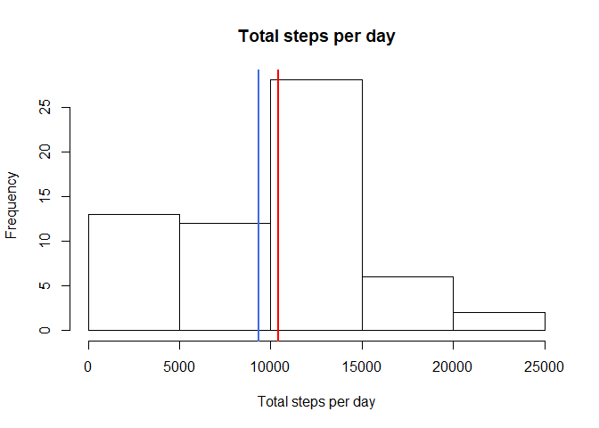
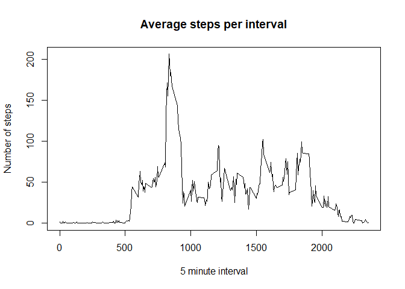
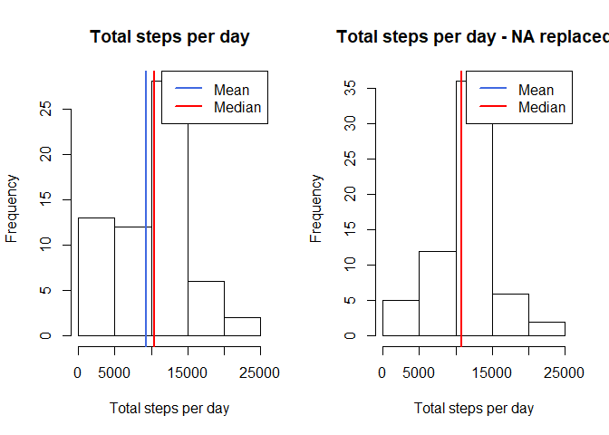
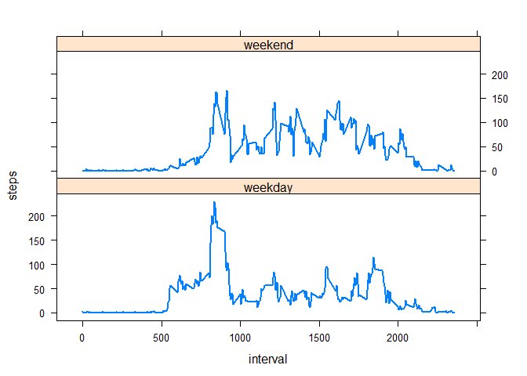

## Assignment Reproducible Research (Week 2)

### Reading in the activity data from .csv file

In the following, the code chunks for loading the required libraries and for reading in the activity data from the csv file are shown:


```r
library(tidyverse)
library(imputeTS)
library(lattice)
data <- read.csv("./activity.csv")
```

## What is mean total number of steps taken per day?


```r
total_steps_per_day <- data %>% group_by(date) %>%  summarise(steps = sum(steps, na.rm = TRUE))
```


After sourcing and running the code above, the total number of steps taken per day can be seen at the following histogram:


```r
hist(total_steps_per_day$steps,main="Total steps per day",xlab = "Total steps per day")
abline(v = mean(total_steps_per_day$steps),col = "royalblue",lwd = 2)
abline(v = median(total_steps_per_day$steps),col = "red", lwd = 2)
```

<!-- -->

Here, the red (royalblue) line stands for the median (mean) value of the histogram. For this calculation, the missing values were removed. The mean value while ignoring NS큦 is 


```r
mean(total_steps_per_day$steps)
```

```
## [1] 9354.23
```
and the median amounts to

```r
median(total_steps_per_day$steps)
```

```
## [1] 10395
```

## What is the average daily activity pattern?

To answer that question, a time series plot of the 5-minute interval (x-axis) and the average number of steps taken is created, which is averaged across all days (y-axis): 


```r
avsteps_per_interval <- data %>% group_by(interval) %>% summarise(steps = mean(steps, na.rm = TRUE))
max_average_steps<-avsteps_per_interval[which.max(avsteps_per_interval$steps),]$interval
```


```r
plot(x=avsteps_per_interval$interval,y=avsteps_per_interval$steps,type = "l",main = "Average steps per interval",ylab="Number of steps",xlab = "5 minute interval")
```

<!-- -->
The 5-minute interval, on average across all the days in the dataset, which corresponds to the maximum number of steps is calculated via:


```r
max_average_steps<-avsteps_per_interval[which.max(avsteps_per_interval$steps),]$interval
print(max_average_steps)
```

```
## [1] 835
```
## Imputing missing values
There are a number of days/intervals where there are missing values (NA큦). The presence of missing days may introduce bias into some calculations or summaries of the data. Therefore, these NA큦 will be replaced by the daily mean value for the individual interval. 

The total number of missing values in the dataset (i.e. the total number of rows with NA\color{red}{\verb|NA|}NAs) is calculated via:

```r
sum(apply(data, 1, anyNA)) # calculates the number of rows with NA, 1 means function (anyNA) is applied
```

```
## [1] 2304
```
For filling these NA큦, the daily mean for each 5 min interval is used and the new data set is denoted as new_data. It is obtained in the following way:


```r
avsteps_per_interval <- data %>% group_by(interval) %>% summarise(steps = mean(steps, na.rm = TRUE))
joined_data<-left_join(data,avsteps_per_interval,by="interval")
replaced_data<-ifelse(is.na(joined_data$steps.x),joined_data$steps.y,joined_data$steps.x)
joined_data$steps.x<-ifelse(is.na(joined_data$steps.x),joined_data$steps.y,joined_data$steps.x)
new_data<-joined_data%>%select(steps.x,date,interval)
new_data<-new_data%>%rename(steps=steps.x)
```

For comparison, the total steps per day, and also the mean and median shall be calculated again, based on the new data set:


```r
total_steps_per_day_replaced <- new_data %>% group_by(date) %>%  summarise(steps = sum(steps))
mean(total_steps_per_day_replaced$steps)
```

```
## [1] 10766.19
```

```r
median(total_steps_per_day_replaced$steps)
```

```
## [1] 10766.19
```

A comparison shows, that the mean and the median based on the new data set are not distinguishable, while the old data set shows smaller mean and median values, which also differ compared between each other.


```r
par(mfrow=c(1,2))
hist(total_steps_per_day$steps,main="Total steps per day",xlab = "Total steps per day")
abline(v = mean(total_steps_per_day$steps),col = "royalblue",lwd = 2)
abline(v = median(total_steps_per_day$steps),col = "red", lwd = 2)
legend(x = "topright", # location of legend within plot area
       c("Mean", "Median"),
       col = c("royalblue", "red"),
       lwd = c(2, 2))
hist(total_steps_per_day_replaced$steps,main="Total steps per day - NA replaced",xlab = "Total steps per day")
abline(v = mean(total_steps_per_day_replaced$steps),col = "royalblue",lwd = 2)
abline(v = median(total_steps_per_day_replaced$steps),col = "red", lwd = 2)
legend(x = "topright", # location of legend within plot area
       c("Mean", "Median"),
       col = c("royalblue", "red"),
       lwd = c(2, 2))
```

<!-- -->

## Are there differences in activity patterns between weekdays and weekends?

A new factor variable (weekyday) in the dataset with two levels - "weekday" and "weekend" is created for indicating whether a given date is a weekday or weekend day: 

```r
new_data<-new_data%>%mutate(weekyday=weekdays(as.Date(new_data$date, format = "%Y-%m-%d")))
new_data$weekyday <- replace(new_data$weekyday,new_data$weekyday=="Samstag", "weekend")
new_data$weekyday <- replace(new_data$weekyday, new_data$weekyday=="Sonntag", "weekend")
new_data$weekyday <- replace(new_data$weekyday,new_data$weekyday!="weekend", "weekday")
```

Based on the new factor variable, a panel plot is created, containing a time series plot of the 5-minute interval (x-axis) and the average number of steps taken, averaged across all weekday days or weekend days (y-axis):


```r
steps_interval_weekdaytype <- aggregate(steps ~ interval + weekyday, data = new_data, FUN = mean)
xyplot(steps~interval|as.factor(weekyday), data=steps_interval_weekdaytype, layout = c(1,2), type="l", lwd=2)
```

<!-- -->
